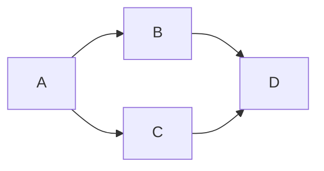

# Mermaider

[](https://www.npmjs.com/package/mermaider)

Simply build [Mermaid](https://mermaid.js.org/) diagram SVGs based on Mardown files.


## Install
```
npm install -g mermaider
```

## Usage

### Define Diagrams
First, create markdown files that contain the diagram definitions, using mermaid syntax. \
The diargram definitions must be in a `mermaid` code fence.

Example:
content of `example-diagram.md`
````markdown

````

Benifit of using markdown files: You can use plugins to highlight definitions and get diagram previews. \
Here is an example, using [Visual Studio Code](https://code.visualstudio.com/): \


### Build Diagrams
Then simply run:
```bash
mermaider [options] <input> <output>
```

Example:
```bash
mermaider --all ./md-files ./svg-files
```

#### Arguments
* input: The input directory where the MD files are.
* output: The output directory where the diagrams will be saved.

#### Options
* -a, --all: Re-build all diagrams. This will also build files that already exist (overwrite).
* -d, --delete: Delete SVG files with no matching MD file.
* -i, --img: Fix svg files to be included as img tag.
* -u, --update: Like -a, but only where the md file is newer than the existing svg file.
* -v, --verbose: Log files while beeing processed.
* -h, --help: display help for command

## ChangeLog

### 0.3.1
* Just fixes my name

### 0.3.0
* Features
  * deletion: with parameter -d svg files will be deleted, if there is no matching md file
* Fixes
  * md file:
    leading and trailing contents before/after mermaid code fence caused mermaid syntax errors

### 0.2.0
* Features
  * img compatibility: now you can pass -i or --img option to make svg files able to be included as img tag.
  * improved overwriting: --update only overwrites existing svg if md is newer.
* Fixes
  * fixed typo: `files already exists` --> `files already exist`

### 0.1.0
Initial Version

## License
[MIT](./LICENSE)
