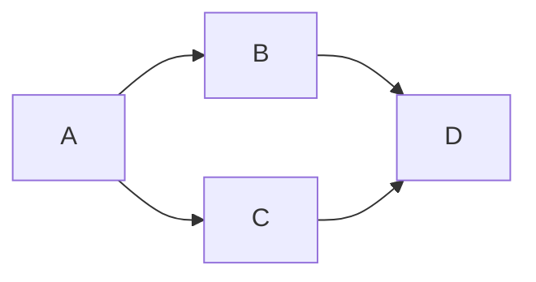

# Mermaid MD to SVG

This CLI Tool builds [Mermaid](https://mermaid.js.org/) diagrams based on definitions in MarkDown files.

## Install
```
npm install -g mermaid-md-svg
```

## Usage

### Define Diagrams
First, create markdown files that contain the diagram definitions, using mermaid syntax. \
The diargram definitions must be in a `mermaid` code fence.

Example:
content of `example-diagram.md`
````markdown

````

Benifit of using markdown files: You can use plugins to highlight definitions and get diagram previews,
for `vs code` for example.

### Build Diagrams
Then simply run:
```bash
mermaid-md-svg [options] <input> <output>
```

Example:
```bash
mermaid-md-svg -all ./md-files ./svg-files
```

#### Arguments
* input: The input directory where the MD files are.
* output: The output directory where the diagrams will be saved.

#### Options
* -a, --all: Re-build all diagrams. This will also build files that already exists (overwrite).
* -v, --verbose: Log files while beeing processed.
* -h, --help: display help for command

## License
[MIT](./LICENSE)
