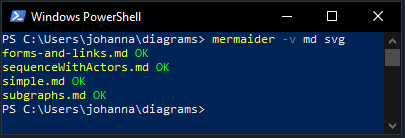

# Mermaider

[](https://www.npmjs.com/package/mermaider)

Simply build [Mermaid](https://mermaid.js.org/) diagram SVGs based on Mardown files.



## Install
```
npm install -g mermaider
```

## Usage

### Define Diagrams
First, create markdown files that contain the diagram definitions, using mermaid syntax. \
The diargram definitions must be in a `mermaid` code fence.

Example:
content of `example-diagram.md`
````markdown

````

Benifit of using markdown files: You can use plugins to highlight definitions and get diagram previews. \
Here is an example, using [Visual Studio Code](https://code.visualstudio.com/): \


### Build Diagrams
Then simply run:
```bash
mermaider [options] <input> <output>
```

Example:
```bash
mermaider --all ./md-files ./svg-files
```

#### Arguments
* input: The input directory where the MD files are.
* output: The output directory where the diagrams will be saved.

#### Options
* -a, --all: Re-build all diagrams. This will also build files that already exists (overwrite).
* -v, --verbose: Log files while beeing processed.
* -h, --help: display help for command

## License
[MIT](./LICENSE)
