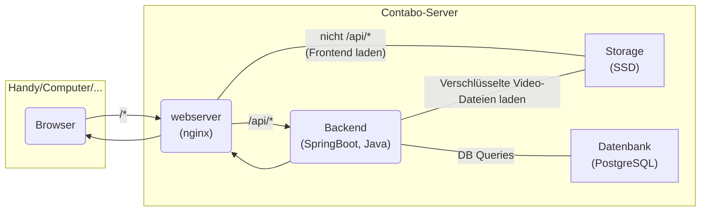

```mermaid
graph LR;
  subgraph Handy/Computer/...
    browser(Browser)
  end

  subgraph Contabo-Server
    webserver("webserver<br>(nginx)") -->|/api/*| backend("Backend<br>(SpringBoot, Java)")
    backend --> webserver
    webserver ---|"nicht /api/*<br>(Frontend laden)"| storage["Storage<br>(SSD)"]
    backend ---|Verschlüsselte Video-Dateien laden| storage
    backend ---|DB Queries| db["Datenbank<br>(PostgreSQL)"]
  end

  browser -->|/*| webserver
  webserver --> browser
```