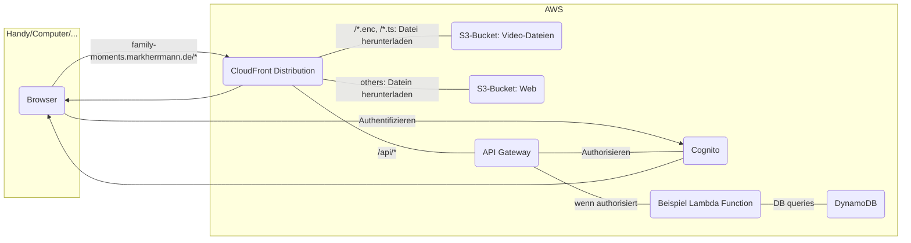

```mermaid
graph LR
  subgraph Handy/Computer/...
    browser(Browser)
  end

  subgraph AWS
     browser -->|family-moments.markherrmann.de/*| cloudfront(CloudFront Distribution)
     browser -->|Authentifizieren| cognito(Cognito)
     cloudfront ---|/*.enc, /*.ts: Datei herunterladen| filesbucket(S3-Bucket: Video-Dateien)
     cloudfront ---|others: Datein herunterladen| webbucket(S3-Bucket: Web)
     cloudfront ---|/api/*| api(API Gateway)
     api ---|Authorisieren| cognito
     api ---|wenn authorisiert| lambda(Beispiel Lambda Function)
     lambda ---|DB queries| db(DynamoDB)
  end

  cloudfront --> browser
  cognito --> browser
```